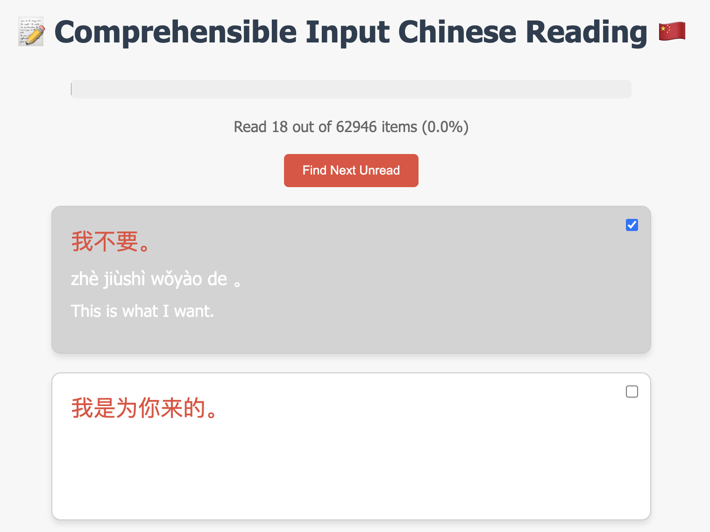

# Immersive Chinese Reading

### What is "comprehensible input" in language learning?
["Comprehensible input" in language learning refers to the concept of exposing learners to language that is slightly above their current level of understanding](https://sanako.com/the-comprehensible-input-approach), allowing them to grasp the overall meaning even if they don't understand every word, thus facilitating natural language acquisition, primarily based on the theory of linguist Stephen Krashen; essentially, it means providing language input that is mostly understandable and can be used to acquire language through exposure rather than explicit instruction.

### What is this website?

Gradually created sentences from the basic sentences that you already now -- At each time, only add 1 new characters.
- The sentence are ordered based on the average of the frequency of each individual characters in the sentence. In another words, if the sentence contains more "high frequent word", it will likely to appear first.
- If the character appear for the first time, it will have the explaination -- After that, no explaination will be provided for this character anymore.
- Purposely set the color of pinyin and translation as "white", so you can only see it after you click -- Remember to try to recall "meaning"/ "pinyin" first before you click to see result~
- After you read, simply click to check progress.
- The progress will be synced via cached -- True for some device.

### Data Sources
- Example sentences: [https://tatoeba.org/en/sentences/show/1](https://tatoeba.org/en/sentences/show/1)
- HSK's vocab: [https://github.com/drkameleon/complete-hsk-vocabulary](https://github.com/drkameleon/complete-hsk-vocabulary)
- Character frequency lists: [https://lingua.mtsu.edu/chinese-computing/statistics/index.html](https://lingua.mtsu.edu/chinese-computing/statistics/index.html)

### What will this website covered?

Based on the HSK's vocab, here're how these sentences will contains all the words in HSK's level:

| HSK Level  | Percentage | Score (Correct/Total) |
|------------|------------|-----------------------|
| HSK 1      | 99.20%     | 493/497               |
| HSK 2      | 98.53%     | 735/746               |
| HSK 3      | 97.05%     | 921/949               |
| HSK 4      | 94.55%     | 919/972               |
| HSK 5      | 89.40%     | 945/1057              |
| HSK 6      | 84.63%     | 947/1119              |
| HSK 7      | 65.57%     | 3670/5597             |

You might be curious about which words are not included... You can found it in [not_matched_words.xlsx](./not_matched_words.xlsx).

### *If you do not like website... Here's a [Google Sheet](https://docs.google.com/spreadsheets/d/1dISz3ESV3eap3ZOMFUqjWa-maZOfdf5cCH-cbOd5glA/edit?usp=sharing)!*

---
祝你学好汉语~
